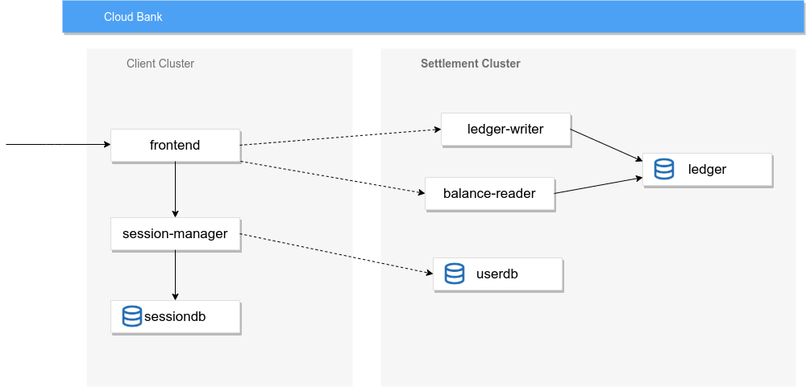

# Cloud Bank - Anthos Sample Application

This project simulates a bank's payment processing network using [Anthos](https://cloud.google.com/anthos/).
Cloud Bank allows users to create artificial accounts and simulate transactions between accounts. The Cloud Bank
infrastructure is disatributed across regions using multiple Anthos GKE clusters, communicating using Anthos 
Service Mesh. Security policies were added using Anthois Config Management.

Cloud Bank was developed to demonstrate how Anthos can be beneficial to financial services companies.


## Architecture



## Installation

Creating a cluster
```
  make cluster \
    PROJECT_ID=my-project ZONE=us-west1-a ACCOUNT=$(gcloud config list account --format "value(core.account)")
```

Deploying Cloud Bank
```
  make deploy \
    PROJECT_ID=my-project ZONE=us-west1-a ACCOUNT=$(gcloud config list account --format "value(core.account)")
```

---

This is not an official Google project.
