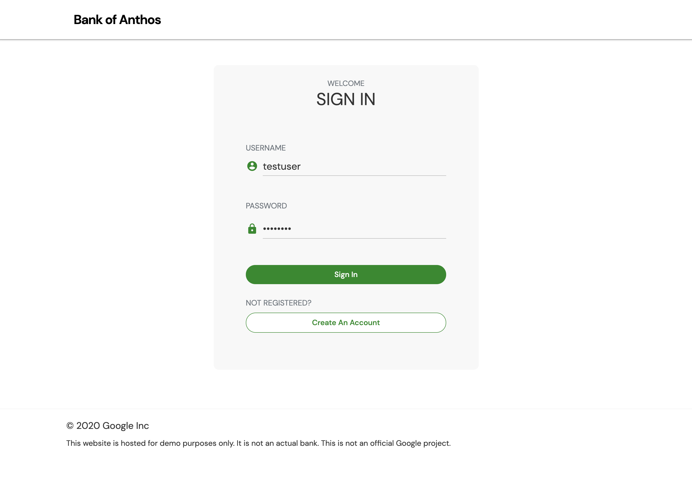
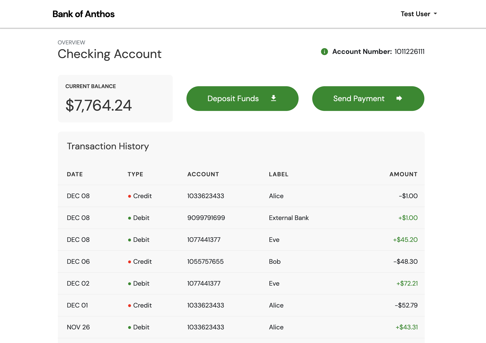

# Bank of Anthos

**Bank of Anthos** is a sample HTTP-based web app that simulates a bank's payment processing network, allowing users to create artificial bank accounts and complete transactions.

Google uses this application to demonstrate how developers can modernize enterprise applications using GCP products, including: [Google Kubernetes Engine](https://cloud.google.com/kubernetes-engine), [Anthos Service Mesh](https://cloud.google.com/anthos/service-mesh), [Anthos Config Management](https://cloud.google.com/anthos/config-management), [Migrate for Anthos](https://cloud.google.com/migrate/anthos), [Spring Cloud GCP](https://spring.io/projects/spring-cloud-gcp), [Cloud Operations](https://cloud.google.com/products/operations), and [Cloud SQL](https://cloud.google.com/sql/docs). This application works on any Kubernetes cluster.

If you are using Bank of Anthos, please ★Star this repository to show your interest!

**Note to Googlers:** Please fill out the form at [go/bank-of-anthos-form](https://goto2.corp.google.com/bank-of-anthos-form).

## Screenshots

| Sign in                                                                                                        | Home                                                                                                    |
| ----------------------------------------------------------------------------------------------------------------- | ------------------------------------------------------------------------------------------------------------------ |
| [](./docs/login.png) | [](./docs/transactions.png) |


## Service architecture


| Service                                          | Language      | Description                                                                                                                                  |
| ------------------------------------------------ | ------------- | -------------------------------------------------------------------------------------------------------------------------------------------- |
| [frontend](./src/frontend)                       | Python        | Exposes an HTTP server to serve the website. Contains login page, signup page, and home page.                                                |
| [ledger-writer](./src/ledgerwriter)              | Java          | Accepts and validates incoming transactions before writing them to the ledger.                                                               |
| [balance-reader](./src/balancereader)            | Java          | Provides efficient readable cache of user balances, as read from `ledger-db`.                                                                |
| [transaction-history](./src/transactionhistory)  | Java          | Provides efficient readable cache of past transactions, as read from `ledger-db`.                                                            |
| [ledger-db](./src/ledger-db)                     | PostgreSQL | Ledger of all transactions. Option to pre-populate with transactions for demo users.                                                         |
| [user-service](./src/userservice)                | Python        | Manages user accounts and authentication. Signs JWTs used for authentication by other services.                                              |
| [contacts](./src/contacts)                       | Python        | Stores list of other accounts associated with a user. Used for drop down in "Send Payment" and "Deposit" forms. |
| [accounts-db](./src/accounts-db)                 | PostgreSQL | Database for user accounts and associated data. Option to pre-populate with demo users.                                                      |
| [loadgenerator](./src/loadgenerator)             | Python/Locust | Continuously sends requests imitating users to the frontend. Periodically creates new accounts and simulates transactions between them.      |

## Interactive quickstart (GKE)

The following button opens up an interactive tutorial showing how to deploy Bank of Anthos in GKE:

[](https://ssh.cloud.google.com/cloudshell/editor?show=ide&cloudshell_git_repo=https://github.com/GoogleCloudPlatform/bank-of-anthos&cloudshell_workspace=.&cloudshell_tutorial=extras/cloudshell/tutorial.md)

## Quickstart (GKE)

1. **[Create a Google Cloud Platform project](https://cloud.google.com/resource-manager/docs/creating-managing-projects#creating_a_project)** or use an existing project. Set the `PROJECT_ID` environment variable and ensure the Google Kubernetes Engine API is enabled.

```
PROJECT_ID=<YOUR-PROJECT-ID>
gcloud services enable container --project ${PROJECT_ID}
```

2. **Clone this repository.**

```
git clone https://github.com/GoogleCloudPlatform/bank-of-anthos.git
cd bank-of-anthos/
```

3. **Create a GKE cluster** and get the credentials for it.

We recommend using [GKE Autopilot](https://cloud.google.com/kubernetes-engine/docs/concepts/autopilot-overview):

```
gcloud services enable container.googleapis.com monitoring.googleapis.com \
  --project ${PROJECT_ID}

REGION=us-central1
gcloud container clusters create-auto bank-of-anthos \
  --project=${PROJECT_ID} --region=${REGION}

gcloud container clusters get-credentials bank-of-anthos \
  --project=${PROJECT_ID} --region=${REGION}
```

Alternatively, you can deploy using GKE Standard instead:

```
ZONE=us-central1-b
gcloud beta container clusters create bank-of-anthos \
  --project=${PROJECT_ID} --zone=${ZONE} \
  --machine-type=e2-standard-2 --num-nodes=4 \
  --monitoring=SYSTEM --logging=SYSTEM,WORKLOAD --subnetwork=default \
  --tags=bank-of-anthos --labels csm=

gcloud container clusters get-credentials bank-of-anthos \
  --project=${PROJECT_ID} --zone=${ZONE}
```

4. **Deploy Bank of Anthos to the cluster.**

```
kubectl apply -f ./extras/jwt/jwt-secret.yaml
kubectl apply -f ./kubernetes-manifests
```

5. **Wait for the Pods to be ready.**

```
kubectl get pods
```

After a few minutes, you should see the Pods in a `Running` state:

```
NAME                                  READY   STATUS    RESTARTS   AGE
accounts-db-6f589464bc-6r7b7          1/1     Running   0          99s
balancereader-797bf6d7c5-8xvp6        1/1     Running   0          99s
contacts-769c4fb556-25pg2             1/1     Running   0          98s
frontend-7c96b54f6b-zkdbz             1/1     Running   0          98s
ledger-db-5b78474d4f-p6xcb            1/1     Running   0          98s
ledgerwriter-84bf44b95d-65mqf         1/1     Running   0          97s
loadgenerator-559667b6ff-4zsvb        1/1     Running   0          97s
transactionhistory-5569754896-z94cn   1/1     Running   0          97s
userservice-78dc876bff-pdhtl          1/1     Running   0          96s
```

6. **Access the web frontend in a browser** using the frontend's external IP.

```
kubectl get service frontend | awk '{print $4}'
```

Visit `https://EXTERNAL_IP` to access your instance of Bank of Anthos.

## Additional deployment options

- **Workload Identity**: [See these instructions.](./docs/workload-identity.md)
- **Cloud SQL**: [See these instructions](./extras/cloudsql) to replace the in-cluster databases with hosted Google Cloud SQL.
- **Multi Cluster with Cloud SQL**: [See these instructions](./extras/cloudsql-multicluster) to replicate the app across two regions using GKE, Multi Cluster Ingress, and Google Cloud SQL.
- **Istio**: Apply `istio-manifests/` to your cluster to access the frontend through the IngressGateway.
- **Anthos Service Mesh**: ASM requires Workload Identity to be enabled in your GKE cluster. [See the workload identity instructions](./docs/workload-identity.md) to configure and deploy the app. Then, apply `istio-manifests/` to your cluster to configure frontend ingress.
- **Java Monolith (VM)**: We provide a version of this app where the three Java microservices are coupled together into one monolithic service, which you can deploy inside a VM (eg. Google Compute Engine). See the [ledgermonolith](./src/ledgermonolith) directory.

## Troubleshooting

See the [troubleshooting guide](./docs/troubleshooting.md) for resolving common problems.

## Development

See the [development guide](./docs/development.md) to learn how to run and develop this app locally.

## Demos featuring Bank of Anthos
- [Explore Anthos (Google Cloud docs)](https://cloud.google.com/anthos/docs/tutorials/explore-anthos)
- [Tutorial - Migrate for Anthos - Migrating a monolith VM to GKE](https://cloud.google.com/migrate/containers/docs/migrating-monolith-vm-overview-setup)
- [Google Cloud Architecture Center - Running distributed services on GKE private clusters using Anthos Service Mesh](https://cloud.google.com/architecture/distributed-services-on-gke-private-using-anthos-service-mesh)
- [Google Cloud Next '20 - Hands-on Keynote](https://www.youtube.com/watch?v=7QR1z35h_yc)  (Anthos, Cloud Operations, Spring Cloud GCP, BigQuery, AutoML)
