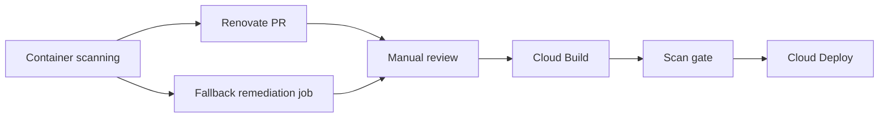

# Security-driven image releases

This document describes how Bank of Anthos detects fixable container vulnerabilities and releases patched images through the existing Cloud Build, Skaffold, and Cloud Deploy pipeline.

## Scope

The following Artifact Registry images are monitored:

| Image | CI pipeline | Source files |
| --- | --- | --- |
| `frontend` | Yes | `src/frontend/Dockerfile`, `requirements.in` |
| `contacts`, `userservice` | Yes | respective `Dockerfile`, `requirements.in` |
| `balancereader`, `ledgerwriter`, `transactionhistory` | Yes | respective `pom.xml` Jib base image |
| `accounts-db`, `ledger-db`, `loadgenerator` | Manual deploy | respective `Dockerfile` |

## Workflow

1. **Detection** — Artifact Registry automatic scanning and Container Analysis record fixable CVEs.
2. **Remediation PR** — Renovate (primary) or the fallback Cloud Build job in [`security/remediate/`](../security/remediate/) opens a PR against `cursor-test` during rollout.
3. **Review** — You review the PR manually. Auto-merge is disabled.
4. **Release** — After merge, the normal per-service Cloud Build pipeline builds, runs the container scan gate, tests, and creates a Cloud Deploy release.
5. **Verification** — The scan gate in [`security/scripts/container-scan-gate.sh`](../security/scripts/container-scan-gate.sh) fails the build if fixable HIGH/CRITICAL CVEs remain.



## Remediation sources

### Renovate

Configured in [`.github/renovate.json5`](../.github/renovate.json5):

- Vulnerability and OSV alerts enabled
- Dockerfiles, Maven/Jib, and pip-compile managers enabled
- Security updates run immediately on `cursor-test`
- PRs labeled `security` and `automated-remediation`

Install the Renovate GitHub App on the repository fork used by Cloud Build.

### Fallback remediation job

Terraform provisions:

- Pub/Sub topic `container-vulnerability-notifications`
- Daily Cloud Scheduler job (06:00 UTC)
- Pub/Sub-triggered Cloud Build job using [`security/remediate/cloudbuild.yaml`](../security/remediate/cloudbuild.yaml)

Before the job can open PRs, store GitHub App credentials in Secret Manager secret `security-remediation-github-app`:

```json
{
  "installation_token": "<short-lived token or app credentials managed by your secret rotation>"
}
```

The job maps registry images to source files via [`security/remediate/image-map.yaml`](../security/remediate/image-map.yaml).

## Manual operations

Run a dry-run remediation locally:

```bash
python3 security/remediate/remediate.py \
  --project="${PROJECT_ID}" \
  --github-owner="${GITHUB_OWNER}" \
  --github-repo="bank-of-anthos" \
  --target-branch="cursor-test" \
  --workspace="." \
  --dry-run
```

Trigger the Cloud Build job manually:

```bash
gcloud builds triggers run security-remediation-vuln-event \
  --project="${PROJECT_ID}" \
  --region="${REGION}"
```

Run unit tests:

```bash
python3 -m unittest security/remediate/test_remediate.py
```

## Review checklist

Before merging a security remediation PR:

- Confirm the CVE is addressed by the proposed base image or dependency bump
- Check Skaffold tests still pass in CI
- Watch for major base image version changes (Python, Temurin, Postgres)
- Verify only the intended service files changed

## Branch promotion

During rollout, remediation PRs target `cursor-test`. After the feature is validated:

1. Open a PR from `cursor-test` to `master` (or your production sync branch)
2. Review and merge manually
3. Update `local.security_remediation_target_branch` in [`security-scanning.tf`](../iac/tf-multienv-cicd-anthos-autopilot/security-scanning.tf) and Renovate `baseBranches` to match your production sync branch

## Expected timing

| Stage | Target |
| --- | --- |
| Detection | Continuous on push; daily scheduled rescan |
| Remediation PR | Within 24 hours of fixable finding |
| Image release | After PR merge and successful CI |
