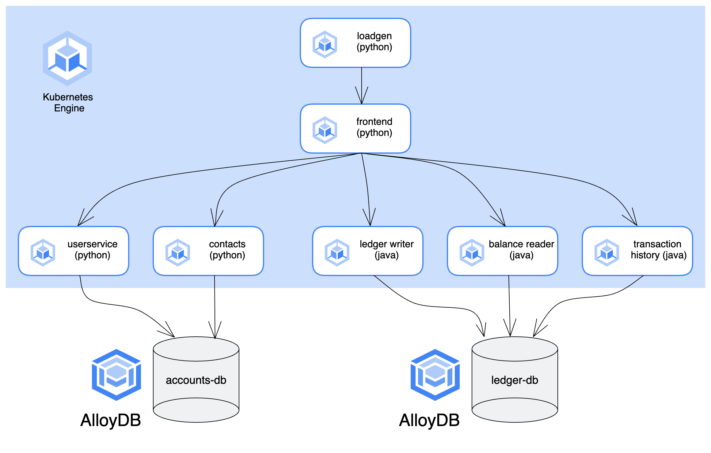

# AlloyDB + Bank of Anthos

This directory contains instructions and Kubernetes manifests for overriding the default in-cluster PostgreSQL databases (`accountsdb` + `ledgerdb`) with AlloyDB.



## How it works

The setup scripts provided will provision an AlloyDB cluster with a primary instance in your Google Cloud Project. The script will then create two databases - one for the **accounts DB**, one for the **ledger DB**. This replaces the two separate PostgreSQL StatefulSets used in Bank of Anthos by default.


## Setup

1. **Create a [Google Cloud project](https://cloud.google.com/resource-manager/docs/creating-managing-projects)** if you don't already have one. Clone this project.
```
git clone https://github.com/gitteroy/bank-of-anthos.git
cd bank-of-anthos/extras/alloydb
```

2. **Set environment variables** corresponding to your project, desired GCP region/zone, and the Kubernetes namespace into which you want to deploy Bank of Anthos. Please replace "my-project" with your Project ID.

```
export PROJECT_ID="my-project"
```
```
export REGION="us-east1"
export ZONE="us-east1-b"
export CLUSTER="kube-cluster"
export NAMESPACE="default"
export ALLOYDB_CLUSTER="alloydb-cluster"
export ALLOYDB_INSTANCE="alloydb-instance"
export VM_NAME="alloydb-client"
```

3. **Enable the Required APIs**. 

```
gcloud config set project ${PROJECT_ID}
gcloud services enable container.googleapis.com
gcloud services enable alloydb.googleapis.com
gcloud services enable compute.googleapis.com
gcloud services enable servicenetworking.googleapis.com
```

4. **Create a GKE cluster** with [Workload Identity](https://cloud.google.com/kubernetes-engine/docs/how-to/workload-identity#overview) enabled. Workload Identity lets you use a Kubernetes service account like a Google Cloud service account, giving your pods granular Google Cloud API permissions - in this case, permission for the Bank of Anthos Pods to access AlloyDB.

```
gcloud container clusters create $CLUSTER \
	--project=$PROJECT_ID --zone=$ZONE \
	--machine-type=e2-standard-4 --num-nodes=4 \
	--workload-pool="$PROJECT_ID.svc.id.goog"
```

5. **Run the Workload Identity setup script** for your new cluster. This script creates a Google Service Account (GSA) and Kubernetes Service Account (KSA), associates them together, then grants the service account permission to access AlloyDB.

```
chmod +x setup_workload_identity.sh
./setup_workload_identity.sh
```

6. **Configure [Private Services Access](https://cloud.google.com/vpc/docs/configure-private-services-access?_ga=2.196186028.-122724777.1678194777) connection for default network**. Set up Private Services Access connection that enables your services to communicate exclusively using internal IP address.
```
gcloud compute addresses create peering-network --network=default --global --prefix-length=20
gcloud services vpc-peerings connect \
    --service=servicenetworking.googleapis.com \
    --ranges=peering-network \
    --network=default
```

7. **Create an AlloyDB cluster with a primary instance**. This takes a few minutes to complete. We also create Compute Engine VM as a client to SSH into the AlloyDB instance in the next step. 
```
chmod +x create_alloydb_cluster_and_instance.sh
./create_alloydb_cluster_and_instance.sh
```
8. **Create VM to access the AlloyDB instance**. It must have the https://www.googleapis.com/auth/cloud-platform access scope so that it can use the AlloyDB API. It must also be installed with the postgresql-client for us to access the psql terminal.
```
gcloud compute instances create $VM_NAME \
    --zone=$ZONE \
    --scopes=https://www.googleapis.com/auth/cloud-platform \
    --metadata=startup-script='#! /bin/bash
        apt-get update
        apt-get install -y postgresql-client'
```
9. **Launch the psql client and access the instance using the postgres user.** 
```
export ALLOY_IP=$(gcloud alloydb instances describe $ALLOYDB_INSTANCE --cluster=$ALLOYDB_CLUSTER --region=$REGION --format="value(ipAddress)")
echo "AlloyDB Instance IP: $ALLOY_IP"
```
```
gcloud compute ssh $VM_NAME --zone=${ZONE}
```
Replace <ALLOYDB_IP> with the ALLOY_IP printed above, or look for the IP address at the AlloyDB console. The password for the instance is "postgres".
```
psql -h <ALLOYDB_IP> -U postgres
```

10. **In the postgres instance, create the `accounts-db` and `ledger-db` database.**
```
CREATE DATABASE "accounts-db";
CREATE DATABASE "ledger-db";
GRANT ALL PRIVILEGES ON DATABASE "accounts-db" TO postgres;
GRANT ALL PRIVILEGES ON DATABASE "ledger-db" TO postgres;
\q
```
```
exit
```

11. **Create a AlloyDB admin demo secret** in your GKE cluster. This gives your in-cluster AlloyDB client a username and password to access AlloyDB. (Note that postgres/postgres credentials are for demo use only and should never be used in a production environment.)

```
export ALLOYDB_CONNECTION_NAME=$(gcloud alloydb instances describe $ALLOYDB_INSTANCE \
    --cluster=$ALLOYDB_CLUSTER \
    --region=$REGION \
    --format="value(name)")

kubectl create secret -n $NAMESPACE generic alloydb-admin \
 --from-literal=username=postgres --from-literal=password=postgres \
 --from-literal=connectionName=$ALLOYDB_CONNECTION_NAME
```

12. **Deploy Bank of Anthos** to your cluster. Each backend Deployment (`userservice`, `contacts`, `transactionhistory`, `balancereader`, and `ledgerwriter`) is configured with a [AlloyDB Auth Proxy](https://cloud.google.com/alloydb/docs/auth-proxy/overview) sidecar container. AlloyDB Auth Proxy provides a secure TLS connection between the backend GKE pods and your AlloyDB instance.

This command will also deploy two Kubernetes Jobs, to populate the accounts and ledger dbs with Tables and test data.

```
kubectl apply -n $NAMESPACE -f ./kubernetes-manifests/config.yaml
kubectl apply -n $NAMESPACE -f ./populate-jobs
kubectl apply -n $NAMESPACE -f ./kubernetes-manifests
```

13. Wait a few minutes for all the pods to be `RUNNING`. (Except for the two `populate-` Jobs. They should be marked `0/3 - Completed` when they finish successfully.)
```
kubectl get pods
```
```
NAME                                  READY   STATUS      RESTARTS   AGE
balancereader-5f669b889d-rpmgr        2/2     Running     0          10m
contacts-64fd77f999-76z8m             2/2     Running     0          10m
frontend-7f55f44648-r7bv9             1/1     Running     0          10m
ledgerwriter-84bbcd9945-7f7qc         2/2     Running     0          10m
loadgenerator-7cd4cbbffb-z6crs        1/1     Running     0          10m
populate-accounts-db-v7q6b            0/3     Completed   0          10m
populate-ledger-db-42j54              0/3     Completed   0          10m
transactionhistory-677ccffbfc-rgnm9   2/2     Running     0          10m
userservice-696cfdfb9b-pt7cg          2/2     Running     0          10m
```

14. Access the Bank of Anthos frontend at the frontend service `EXTERNAL_IP`, then log in as `test-user` with the pre-populated credentials added to the AlloyDB-based `accounts-db`. You should see the pre-populated transaction data show up, from the AlloyDB-based `ledger-db`. You're done!