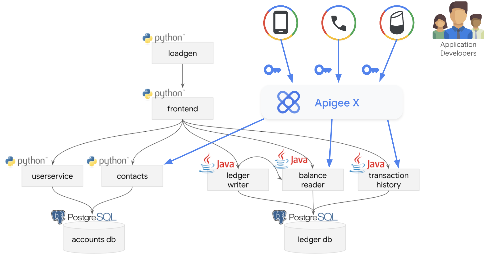
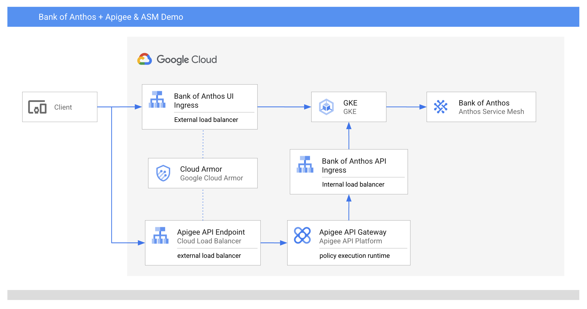

# Apigee + ASM

This directory contains assets and instructions to leverage [Apigee API Management](https://cloud.google.com/apigee) + [Anthos Service Mesh](https://cloud.google.com/anthos/service-mesh) to expose the Bank of Anthos microservices as a set of secure, managed APIs which can be accessed by other applications (e.g. mobile apps, voice assistants and more) or by partner developers.



## Apigee Overview

The [Apigee platform](https://cloud.google.com/apigee/docs/api-platform/get-started/what-apigee) consists of a number of components. These include the API runtime, management services, monitoring and analytics, and developer services that together provide a comprehensive infrastructure for API creation, security, management, and operations.

For API producers, Apigee provides a range of policies covering API security, quotas, caching, transformation, validation, traffic routing and more. 

[Apigee Developer Portals](https://cloud.google.com/apigee/docs/api-platform/publish/publishing-overview) allow producers to publish API docs from OpenAPI specifications, and consumers can discover the APIs, read the docs and register app credentials. 

[Apigee Analytics](https://cloud.google.com/apigee/docs/api-platform/analytics/analytics-services-overview) and [API Monitoring](https://cloud.google.com/apigee/docs/api-monitoring) provides detailed reporting on API performance and usage metrics, while [Apigee Monetization](https://cloud.google.com/apigee/docs/api-platform/monetization/overview) allows producers to charge for paid API traffic. Additional features such as [Advanced API Security](https://cloud.google.com/apigee/docs/api-security) and [Advanced API Ops](https://cloud.google.com/apigee/docs/aapi-ops) provide ML-based traffic anomaly and bot detection, plus tools to identify misconfigured APIs.

## How It Works



Apigee can be configured to serve direct API requests through a separate ingress path, in addition to the frontend ingress that exposes the Bank of Anthos web application. The API ingress is only accessible via Apigee, which provides security, authentication and rate limiting for consuming apps.

For API authorization requests, Bank of Anthos now supports the ability to authorize external access requests made using an [OAuth 2.0 Authorization Code grant type](https://oauth.net/2/grant-types/authorization-code/). Apigee can act as the [authorization server](https://cloud.google.com/apigee/docs/api-platform/security/oauth/oauth-home) that issues and validates the access tokens used to call the APIs securely. This directory contains a [ConfigMap](https://kubernetes.io/docs/concepts/configuration/configmap/) that defines an allowed OAuth client ID and redirect URI. The Bank of Anthos frontend service will use these to validate incoming OAuth requests from Apigee. These values must be replaced with a client ID and redirect URI that is defined in Apigee (this is performed by the setup script below).

## Prerequisites

Anthos Service Mesh (ASM) must be installed in your cluster. See [here](https://cloud.google.com/service-mesh/docs/unified-install/install-anthos-service-mesh).

An Apigee Organization must be provisioned. Learn how to provision a free eval org [here](https://cloud.google.com/apigee/docs/api-platform/get-started/eval-orgs).

During Apigee provisioning the instance must be configured with external internet access enabled. For instructions see [here](https://cloud.google.com/apigee/docs/api-platform/get-started/eval-orgs#access-routing). The instance should be deployed in the same GCP region and VPC network as the Bank of Anthos cluster.

Make sure the following tools are available in your terminal `$PATH`. If you're running in [Google Cloud Shell](https://cloud.google.com/shell) some of these will already be available.
- zip
- sed
- kubectl
- [gcloud](https://cloud.google.com/sdk/docs/install)
- [apigeecli](https://github.com/apigee/apigeecli)

## Setup

1. **Set environment variables** corresponding to your project, GCP region and zone, GKE cluster and namespace into which you deployed Bank of Anthos, plus the Apigee [environment](https://cloud.google.com/apigee/docs/api-platform/fundamentals/environments-overview) and corresponding environment group hostname you wish to use. For example:

```
export PROJECT="my-project"
export REGION="us-central1"
export ZONE="us-central1-a"
export CLUSTERNAME="my-cluster-name"
export BOA_NAMESPACE="boa"
export APIGEE_ENV="eval"
export APIGEE_HOST="34.110.30.110.nip.io"
```

2. **Run the API ingress deployment script**.

```
./deploy-api-ingress.sh
```

3. **Run the Apigee artifact deployment script**. This will take a few minutes to complete.

```
./deploy-apigee-artifacts.sh
```

At the end this script should prompt you to open an authentication link in your browser. You will need to login to the Bank of Anthos application and provide consent. You should then be presented with an OAuth authorization code which you will enter in the terminal to proceed. The script will return some example cURL calls containing an access token which you can use to call the APIs.

4. (Manual step) Create an [Apigee developer portal](https://cloud.google.com/apigee/docs/api-platform/publish/portal/build-integrated-portal) to publish and expose the API docs. Instructions can be found [here](https://cloud.google.com/apigee/docs/api-platform/publish/portal/get-started/overview).