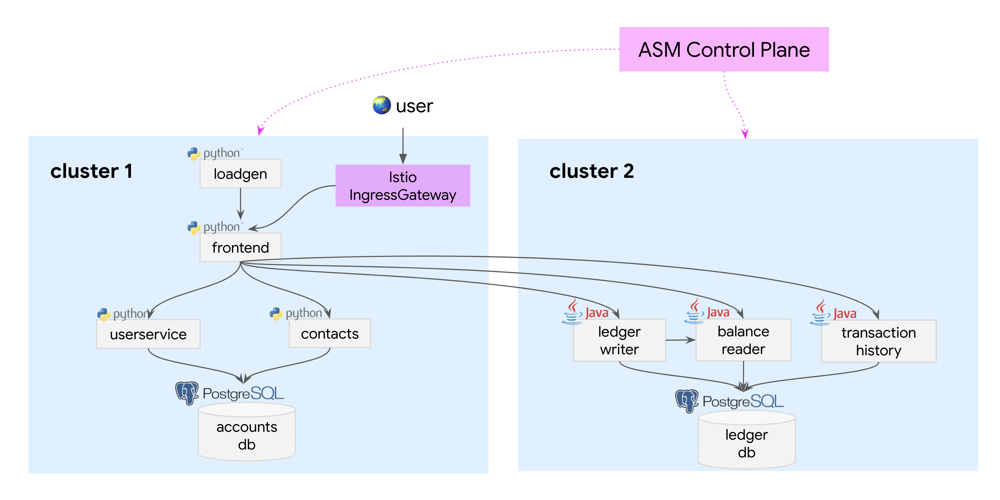
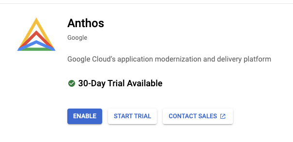
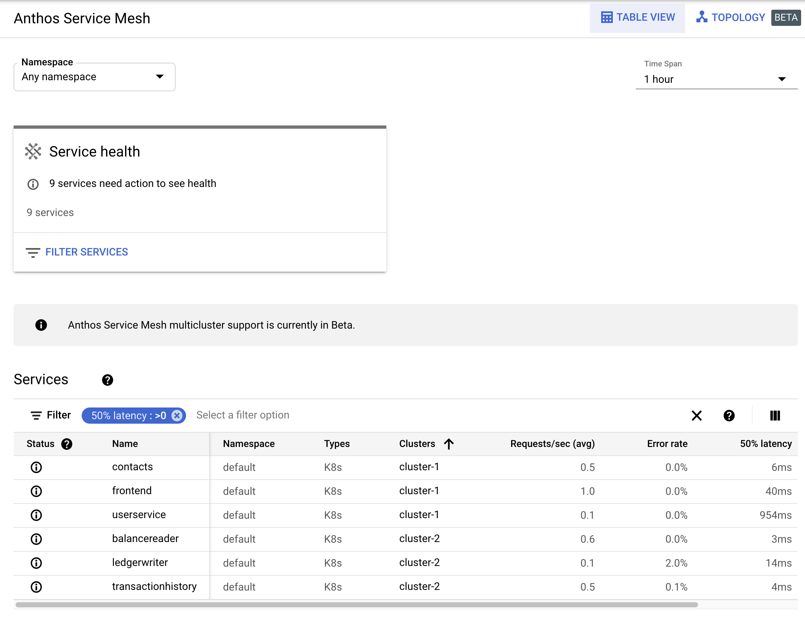
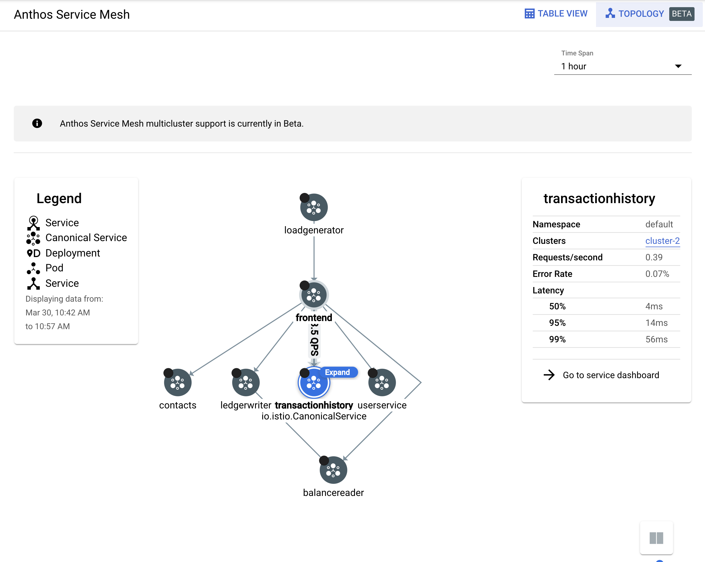

# Anthos Service Mesh - Multi Cluster

This demo shows how to install Bank of Anthos across 2 clusters, using [Anthos Service Mesh endpoint discovery](https://cloud.google.com/service-mesh/docs/managed-control-plane#configure_endpoint_discovery_only_for_multi-cluster_installations) for cross-cluster routing.

For a "replicated" multicluster setup with no cross-cluster traffic, see the [Cloud SQL + Multi Cluster](/extras/cloudsql-multicluster) demo.

## Architecture



## Prerequisites

1. A Google Cloud project.
2. The following tools installed in your local environment:

- [gcloud](https://cloud.google.com/sdk/docs/install), up to date with `gcloud components update`
- [kubectl](https://cloud.google.com/sdk/gcloud/reference/components/install) - you can install this via gcloud: `gcloud components install kubectl`
- [kubectx](https://github.com/ahmetb/kubectx#installation)
- (MacOS only) coreutils: `brew install coreutils`
- (MacOS only) jq: `brew install jq`
- (MacOS only) kpt:

```
brew tap GoogleContainerTools/kpt https://github.com/GoogleContainerTools/kpt.git
brew install kpt
```

## Steps

1. **Set variables.**

```
export PROJECT_ID="<your-project-id>"
gcloud config set project $PROJECT_ID
```

2. **Enable APIs.**

```
gcloud services enable container.googleapis.com anthos.googleapis.com
```

3. **Make sure you've `cd`-ed into this directory, then run the cluster setup script**. This script creates 2 GKE clusters, `cluster-1` and `cluster-2`, installs Anthos Service Mesh, and sets up cross-cluster endpoint discovery. This script takes about 10 minutes to run.

```
cd extras/asm-multicluster/
./cluster-setup.sh
```

4. **Verify that your local kubectx is set up** for `cluster-1` and `cluster-2`, and that you can access both clusters.

```
kubectx cluster-1
kubectl get nodes
```

You should see:

```
NAME                                       STATUS   ROLES    AGE   VERSION
gke-cluster-1-default-pool-855fbe61-6fhx   Ready    <none>   62m   v1.18.15-gke.1501
gke-cluster-1-default-pool-855fbe61-748b   Ready    <none>   62m   v1.18.15-gke.1501
gke-cluster-1-default-pool-855fbe61-f3qw   Ready    <none>   62m   v1.18.15-gke.1501
gke-cluster-1-default-pool-855fbe61-tw2z   Ready    <none>   62m   v1.18.15-gke.1501
```

5. **Deploy the Bank of Anthos app across both clusters**. This will deploy the frontend and Python backends to cluster-1, and the Java backends to cluster 2. Note that ASM endpoint discovery only works if all the Kubernetes Services are deployed to both clusters, so that's what we're doing here.

**Note** - you should run these commands from this directory. (`extras/asm-multicluster`).

```
kubectx cluster-1
kubectl apply -f services-all.yaml
kubectl apply -f ../../kubernetes-manifests/config.yaml
kubectl apply -f ../../extras/jwt/jwt-secret.yaml
kubectl apply -f ../../kubernetes-manifests/accounts-db.yaml
kubectl apply -f ../../kubernetes-manifests/contacts.yaml
kubectl apply -f ../../kubernetes-manifests/frontend.yaml
kubectl apply -f ../../kubernetes-manifests/userservice.yaml
kubectl apply -f ../../kubernetes-manifests/loadgenerator.yaml
kubectl apply -f ../../istio-manifests/frontend-ingress.yaml

kubectx cluster-2
kubectl apply -f services-all.yaml
kubectl apply -f ../../kubernetes-manifests/config.yaml
kubectl apply -f ../../extras/jwt/jwt-secret.yaml
kubectl apply -f ../../kubernetes-manifests/ledger-db.yaml
kubectl apply -f ../../kubernetes-manifests/balance-reader.yaml
kubectl apply -f ../../kubernetes-manifests/ledger-writer.yaml
kubectl apply -f ../../kubernetes-manifests/transaction-history.yaml
```

6. **Verify that the pods start up successfully.** Note that you should see 2 containers per pod `(2/2)`, one containing the Bank of Anthos service container, the other containing the ASM sidecar proxy (Envoy).

```
kubectx cluster-1; kubectl get pods
```

You should see:

```
NAME                             READY   STATUS    RESTARTS   AGE
accounts-db-0                    2/2     Running   0          14m
contacts-848bbff9bd-bjtrh        2/2     Running   0          14m
frontend-565f986f97-r5tdq        2/2     Running   0          14m
loadgenerator-797dfd6c5c-r86vn   2/2     Running   0          14m
userservice-7c9bc855f5-ff8tq     2/2     Running   0          14m
```

Do the same for cluster-2:

```
kubectx cluster-2; kubectl get pods
```

You should see:

```
NAME                                  READY   STATUS    RESTARTS   AGE
balancereader-5f57666b9c-l9q4b        2/2     Running   0          14m
ledger-db-0                           2/2     Running   0          14m
ledgerwriter-7d88d5898c-vhs5l         2/2     Running   0          14m
transactionhistory-84cf479f65-lzgdt   2/2     Running   0          14m
```

7. **Access the Bank of Anthos frontend** using the Istio IngressGateway's LoadBalancer IP.

```
kubectx cluster-1; kubectl get svc istio-ingressgateway --namespace asm-ingress

NAME                   TYPE           CLUSTER-IP     EXTERNAL-IP     PORT(S)                                                                      AGE
istio-ingressgateway   LoadBalancer   10.7.254.103   <EXTERNAL_IP>  15021:30429/TCP,80:32101/TCP,443:31503/TCP,15012:30573/TCP,15443:31131/TCP   21m
```

Navigate to the `EXTERNAL_IP` in a browser; you should see the Bank of Anthos login page.

8. **Open the Google Cloud Console, and navigate to Anthos > Service Mesh**. You may see an Anthos window pop up - click "Enable."



9. View the Bank of Anthos services in the Anthos Service Mesh dashboard. In the Table view, you should see metrics populated for services in both cluster-1 and cluster 2.



In the topology view, you should see traffic flowing from cluster 1 services (frontend) to cluster 2 services (eg. transactionhistory).


