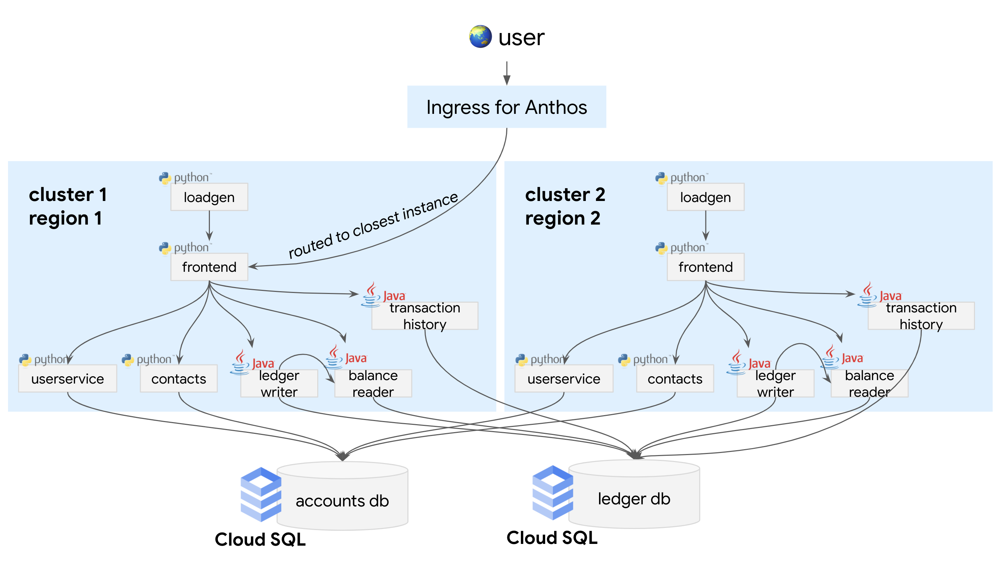

# Multi Cluster Bank of Anthos with Cloud SQL

This doc contains instructions for deploying the Cloud SQL version of Bank of Anthos in a multi-region high availability / global configuration.

The use case for this setup is to demo running a global, scaled app, where even if one cluster goes down, users will be routed to the next available cluster. These instructions also show how to use [Multi Cluster Ingress](https://cloud.google.com/kubernetes-engine/docs/concepts/multi-cluster-ingress) to route users to the closest GKE cluster, demonstrating a low-latency use case.

This guide has two parts to it:
1. Deploy Bank of Anthos on 2 GKE clusters with **Multi Cluster Ingress** for
   intelligent load balancing between the 2 clusters.
2. Configure the **Multi Cluster Ingress** to use **TLS** with a self-signed
   certificate and enforce **HTTP to HTTPS** redirection for all inbound
   traffic.



Note that in this setup, there is no service communication between the two
clusters/regions. Each cluster has a dedicated frontend and set of backends.
Both regions, however, share the same Cloud SQL instance, which houses the two
databases ***(Accounts and Ledger)***.

---

## Prerequisites

- The [**kubectx**](https://github.com/ahmetb/kubectx) command line tool
  installed
- An active [Anthos license](https://cloud.google.com/kubernetes-engine/docs/concepts/multi-cluster-ingress#pricing_and_trials)

---
## Part 1

1. **Create a [Google Cloud project](https://cloud.google.com/resource-manager/docs/creating-managing-projects)** if you don't already have one.

2. **Set environment variables**, where `DB_REGION` is where the Cloud SQL instance will be deployed


```
export PROJECT_ID="my-project"
export DB_REGION="us-central1"
export CLUSTER_1_NAME="boa-1"
export CLUSTER_1_ZONE="us-central1-b"
export CLUSTER_2_NAME="boa-2"
export CLUSTER_2_ZONE="europe-west3-a"
export NAMESPACE="default"
```

3. **Enable the Google Cloud container API services**.
```sh
gcloud services enable container.googleapis.com --project=${PROJECT_ID}
```

4. **Create two GKE clusters, one per region.**

```
gcloud container clusters create ${CLUSTER_1_NAME} \
	--project=${PROJECT_ID} --zone=${CLUSTER_1_ZONE} \
	--machine-type=e2-standard-4 --num-nodes=4 \
	--workload-pool="${PROJECT_ID}.svc.id.goog" --enable-ip-alias

gcloud container clusters create ${CLUSTER_2_NAME} \
	--project=${PROJECT_ID} --zone=${CLUSTER_2_ZONE} \
	--machine-type=e2-standard-4 --num-nodes=4 \
	--workload-pool="${PROJECT_ID}.svc.id.goog" --enable-ip-alias
```

> Note: It can take more than **10 minutes** for both clusters to get created.

5. **Configure kubectx for the clusters.**

```
gcloud container clusters get-credentials ${CLUSTER_1_NAME} --zone ${CLUSTER_1_ZONE} --project ${PROJECT_ID}
kubectx cluster1="gke_${PROJECT_ID}_${CLUSTER_1_ZONE}_${CLUSTER_1_NAME}"

gcloud container clusters get-credentials ${CLUSTER_2_NAME} --zone ${CLUSTER_2_ZONE} --project ${PROJECT_ID}
kubectx cluster2="gke_${PROJECT_ID}_${CLUSTER_2_ZONE}_${CLUSTER_2_NAME}"
```

6. **Set up Workload Identity** for both clusters.

```
kubectx cluster1
../cloudsql/setup_workload_identity.sh

kubectx cluster2
../cloudsql/setup_workload_identity.sh
```

7. **Run the Cloud SQL instance create script** on both clusters.

```
kubectx cluster1
../cloudsql/create_cloudsql_instance.sh

kubectx cluster2
../cloudsql/create_cloudsql_instance.sh
```
> Note: Setting up the `CloudSQL` instance can sometimes take more than 10 minutes.

8. **Create Cloud SQL admin secrets** in your GKE clusters. This gives your in-cluster Cloud SQL clients a username and password to access Cloud SQL. (Note that admin/admin credentials are for demo use only and should never be used in a production environment.)

```
INSTANCE_NAME='bank-of-anthos-db'
INSTANCE_CONNECTION_NAME=$(gcloud sql instances describe $INSTANCE_NAME --format='value(connectionName)')

kubectx cluster1
kubectl create secret -n ${NAMESPACE} generic cloud-sql-admin \
 --from-literal=username=admin --from-literal=password=admin \
 --from-literal=connectionName=${INSTANCE_CONNECTION_NAME}

kubectx cluster2
kubectl create secret -n ${NAMESPACE} generic cloud-sql-admin \
 --from-literal=username=admin --from-literal=password=admin \
 --from-literal=connectionName=${INSTANCE_CONNECTION_NAME}
```

9. **Deploy the DB population jobs.**  These are one-off bash scripts that initialize the Accounts and Ledger databases with data. You only need to run these Jobs once, so we deploy them only on `cluster1`.

```
kubectx cluster1
kubectl apply  -n ${NAMESPACE} -f ../cloudsql/kubernetes-manifests/config.yaml
kubectl apply -n ${NAMESPACE} -f ../cloudsql/populate-jobs
```

10. Verify that the Database population Jobs have completed. Wait until the
    `COMPLETIONS` for both the Jobs are `1/1`.
```
kubectl get jobs
```
```
NAME                   COMPLETIONS   DURATION   AGE
populate-accounts-db   1/1           43s        119s
populate-ledger-db     1/1           43s        119s
```

11. **Deploy Bank of Anthos services to both clusters.**

```
kubectx cluster1
kubectl apply  -n ${NAMESPACE} -f ../cloudsql/kubernetes-manifests

kubectx cluster2
kubectl apply  -n ${NAMESPACE} -f ../cloudsql/kubernetes-manifests
```

12. **Delete the LoadBalancer type frontend services**. With `MultiClusterIngress`
    we will be using a `MultiClusterService`.

```sh
kubectx cluster1
kubectl delete svc frontend -n ${NAMESPACE}

kubectx cluster2
kubectl delete svc frontend -n ${NAMESPACE}
```

13.  **Run the Multi Cluster Ingress setup script.** This registers both GKE clusters to Anthos with ***"memberships"*** and sets cluster 1 as the ***"config cluster"*** to administer the Multi Cluster Ingress resources.

```
./register_clusters.sh
```


14. **Create Multi Cluster Ingress resources for global routing.**  This YAML file contains two resources a headless Multi Cluster Kubernetes Service ("MCS") mapped to the `frontend` Pods, and a Multi Cluster Ingress resource, `frontend-global-ingress`, with `frontend-mcs` as the MCS backend. Note that we're only deploying this to Cluster 1, which we've designated as the Multi Cluster Ingress "config cluster."

```
kubectx cluster1
kubectl apply -n ${NAMESPACE} -f multicluster-ingress.yaml
```


15. **Verify that the Multi Cluster Ingress resource was created.** Look for the `Status` field to be populated with two Network Endpoint Groups (NEGs) corresponding to the regions where your 2 GKE clusters are running.

> **Note:** It may take up to 90 seconds before a `VIP` is assigned to the
> MultiClusterIngress resource.

```
watch kubectl describe mci frontend-global-ingress -n ${NAMESPACE}
```

Expected output:

```
Status:
...
    Network Endpoint Groups:
      zones/europe-west3-a/networkEndpointGroups/k8s1-dd9eb2b0-defaul-mci-frontend-mcs-svc-0xt1kovs-808-7e472f17
      zones/us-west1-b/networkEndpointGroups/k8s1-6d3d6f1b-defaul-mci-frontend-mcs-svc-0xt1kovs-808-79d9ace0
    Target Proxies:
      mci-ddwsrr-default-frontend-global-ingress
    URL Map:  mci-ddwsrr-default-frontend-global-ingress
  VIP:        34.120.172.105
```

16. **Copy the `VIP` field** to the clipboard and set as an env variable:

```
export VIP=<your-VIP>
```

17. **Test the geo-aware routing** by curling the `/whereami` frontend endpoint using the global VIP you copied. You could also create a Google Compute Engine instance in a specific region to test further.

> **Note:** You may see `404` or `502` errors for several minutes while the
> forwarding rules propagate. It can take up to 3 minutes and 30 seconds for the
> endpoint to become ready to serve requests.


```
watch curl http://$VIP:80/whereami
```

Example output, from a US-based client where the two GKE regions are `us-west1` and `europe-west3-a`:

```
Cluster: boa-1, Pod: frontend-74675b56f-w4rdf, Zone: us-west1-b
```

Example output, from an EU-based GCE instance:

```
Cluster: boa-2, Pod: frontend-74675b56f-2ln5w, Zone: europe-west3-a
```

> **Note:** You can create a GCE instance in a European region and try the same
> `curl` command from inside that VM.
> ```sh
> gcloud compute instances create europe-instance \
>    --image-family=debian-9 \
>    --image-project=debian-cloud \
>    --network=default \
>    --subnet=default \
>    --zone=europe-west3-a \
>    --tags=allow-ssh
>
> gcloud compute ssh europe-instance --zone=europe-west3-a
> ```
> Try hitting the `/whereami` endpoint from inside this VM and see if you get a
> response from the `boa-2` cluster.

🎉 **Congrats!** You just deployed a globally-available version of Bank of Anthos!

---
## Part 2

Follow the [second part](tls-for-mci.md) of this guide to enable **TLS** support with
**HTTP to HTTPS** redirection on the **Multi Cluster Ingress** resource.
