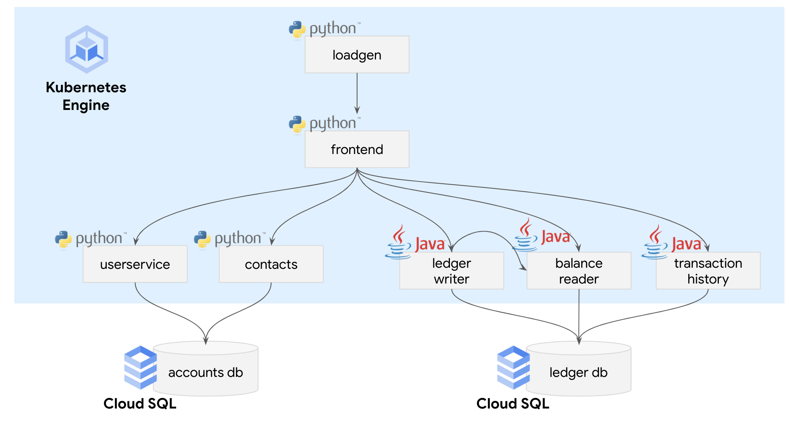

# Cloud SQL + Bank of Anthos

This directory contains instructions and Kubernetes manifests for overriding the default in-cluster PostgreSQL databases (`accountsdb` + `ledgerdb`) with Google Cloud SQL.

For a multicluster/multi-region setup, see [this doc](multi-region.md) for instructions.



## How it works

The setup scripts provided will provision a Cloud SQL instance in your Google Cloud Project. The script will then create two databases - one for the **accounts DB**, one for the **ledger DB**. This replaces the two separate PostgreSQL StatefulSets used in Bank of Anthos by default.


## Setup

1. **Create a [Google Cloud project](https://cloud.google.com/resource-manager/docs/creating-managing-projects)** if you don't already have one.

2. **Set environment variables** corresponding to your project, desired GCP region/zone, and the Kubernetes namespace into which you want to deploy Bank of Anthos.

```
export PROJECT_ID="my-project"
export DB_REGION="us-east1"
export ZONE="us-east1-b"
export CLUSTER="my-cluster-name"
export NAMESPACE="default"
```

3. **Enable the [GKE API](https://cloud.google.com/kubernetes-engine/docs/reference/rest)**. This may take a few minutes.

```
gcloud services enable container.googleapis.com
```

4. **Create a GKE cluster** with [Workload Identity](https://cloud.google.com/kubernetes-engine/docs/how-to/workload-identity#overview) enabled. Workload Identity lets you use a Kubernetes service account like a Google Cloud service account, giving your pods granular Google Cloud API permissions - in this case, permission for the Bank of Anthos Pods to access Cloud SQL.

```
gcloud container clusters create $CLUSTER \
	--project=$PROJECT_ID --zone=$ZONE \
	--machine-type=e2-standard-4 --num-nodes=4 \
	--workload-pool="$PROJECT_ID.svc.id.goog"
```

5. **Run the Workload Identity setup script** for your new cluster. This script creates a Google Service Account (GSA) and Kubernetes Service Account (KSA), associates them together, then grants the service account permission to access Cloud SQL.

```
./setup_workload_identity.sh
```

6. **Run the Cloud SQL instance create script**. This takes a few minutes to complete.

```
./create_cloudsql_instance.sh
```

7. **Create a Cloud SQL admin demo secret** in your GKE cluster. This gives your in-cluster Cloud SQL client a username and password to access Cloud SQL. (Note that admin/admin credentials are for demo use only and should never be used in a production environment.)

```
export INSTANCE_NAME='bank-of-anthos-db'
export INSTANCE_CONNECTION_NAME=$(gcloud sql instances describe $INSTANCE_NAME --format='value(connectionName)')

kubectl create secret -n $NAMESPACE generic cloud-sql-admin \
 --from-literal=username=admin --from-literal=password=admin \
 --from-literal=connectionName=$INSTANCE_CONNECTION_NAME
```

8. **Deploy Bank of Anthos** to your cluster. Each backend Deployment (`userservice`, `contacts`, `transactionhistory`, `balancereader`, and `ledgerwriter`) is configured with a [Cloud SQL Proxy](https://cloud.google.com/sql/docs/mysql/sql-proxy#what_the_proxy_provides) sidecar container. Cloud SQL Proxy provides a secure TLS connection between the backend GKE pods and your Cloud SQL instance.

This command will also deploy two Kubernetes Jobs, to populate the accounts and ledger dbs with Tables and test data.

```
kubectl apply -n $NAMESPACE -f ./kubernetes-manifests/config.yaml
kubectl apply -n $NAMESPACE -f ./populate-jobs
kubectl apply -n $NAMESPACE -f ./kubernetes-manifests
```

9. Wait a few minutes for all the pods to be `RUNNING`. (Except for the two `populate-` Jobs. They should be marked `0/3 - Completed` when they finish successfully.)

```
NAME                                  READY   STATUS      RESTARTS   AGE
balancereader-d48c8d84c-j7ph7         2/2     Running     0          2m56s
contacts-bbfdbb97f-vzxmv              2/2     Running     0          2m55s
frontend-65c78dd78c-tsq26             1/1     Running     0          2m55s
ledgerwriter-774b7bf7b9-jpz7l         2/2     Running     0          2m54s
loadgenerator-f489d8858-q2n46         1/1     Running     0          2m54s
populate-accounts-db-wrh4m            0/3     Completed   0          2m54s
populate-ledger-db-422cr              0/3     Completed   0          2m53s
transactionhistory-747476548c-j2zqx   2/2     Running     0          2m53s
userservice-7f6df69544-nskdf          2/2     Running     0          2m53s
```

10. Access the Bank of Anthos frontend at the frontend service `EXTERNAL_IP`, then log in as `test-user` with the pre-populated credentials added to the Cloud SQL-based `accounts-db`. You should see the pre-populated transaction data show up, from the Cloud SQL-based `ledger-db`. You're done!