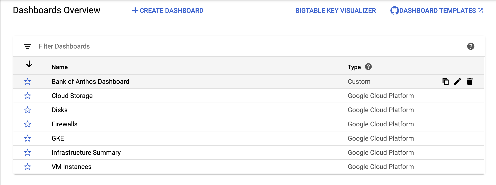
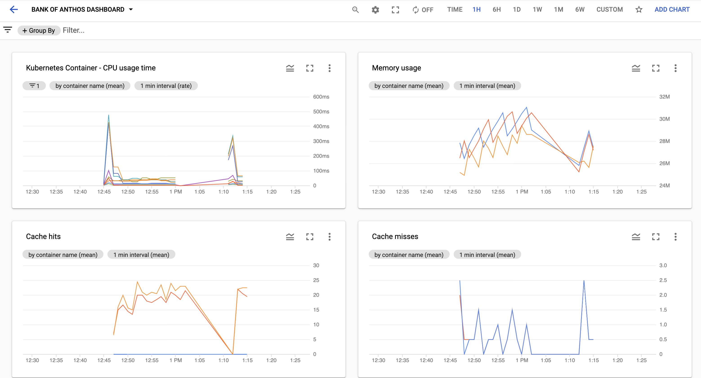

# Cloud Monitoring - Metrics Dashboard Example 

The `dashboard.json` file in this directory provides a built-in view of the Java app-level metrics exported from the three Bank of Anthos Java services (`ledgerwriter`, `balancereader`, `transactionreader`). 

## Adding the dashboard to your project

To add this Cloud Monitoring dashboard to your project, use the Cloud Monitoring [dashboards API](https://cloud.google.com/monitoring/dashboards/api-dashboard): 

1. From the Google Cloud Console, navigate to Cloud Monitoring and ensure you have created a Workspace for your project. If you already have a Workspace, you will see a "Welcome to Monitoring!" message and a set of charts. 
2. From the command line, run:

```
gcloud config set project <your-project-id>
```

3. Then, run:

```
gcloud monitoring dashboards create --config-from-file=dashboard.json
```

4. Open the Cloud Monitoring UI in the Google Cloud Console. Navigate to Dashboards, and you should see the Bank of Anthos dashboard in the list: 




5. Click on the dashboard. If Bank of Anthos is running in GKE inside your project, and the `ENABLE_METRICS` option is set to `true`, you should see the charts populated with Java metrics including JVM cache, and DB queries. 

