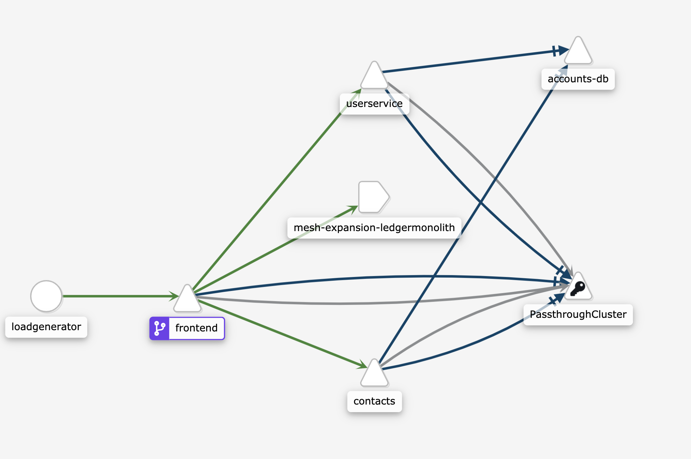

# Deploying the Ledger Monolith with Istio

*note - these instructions have been tested with Istio 1.6.7*: https://istio.io/latest/docs/examples/virtual-machines/single-network/ 


These instructions show you how to deploy the Ledger Monolith on a GCE VM with the Istio proxy, then how to add the Ledger Monolith to an Istio service mesh running in GKE (in the same GCP project, same `default` VPC). 


### Prerequisites 

- A GKE cluster with at least 4 nodes, `e2-standard-4`. 
- skaffold
- go 

### 1 - Set environment variables 

```
PROJECT_ID=<your-project-id>
CLUSTER_NAME=<your-cluster-name>
CLUSTER_ZONE=<your-cluster-zone>
VM_ZONE=<your-vm-zone>
```

### 2 - Install Istio on your GKE cluster 

```
git clone https://github.com/GoogleCloudPlatform/istio-samples
cd ./common
INSTALL_YAML="../mesh-expansion-gce/scripts/install.yaml" ./gke_install_istio.sh
alias istioctl=istio-1.6.7/bin/istioctl
```


### 3 - Create the ledger monolith GCE instance 

```
../scripts/deploy-monolith.sh
```


### 4 - Prepare for GCE Istio install 

These commands extract information from the Istio install on GKE (the pod CIDR, for instance).

```
mkdir -p send-to-vm/ 

SERVICE_NAMESPACE="default"
VM_NAME="ledgermonolith-service"
VM_PORT="8080"

IstiodIP=$(kubectl get -n istio-system service istiod -o jsonpath='{.spec.clusterIP}')
ISTIO_SERVICE_CIDR=$(gcloud container clusters describe $CLUSTER_NAME --zone $CLUSTER_ZONE --project $PROJECT_ID --format "value(servicesIpv4Cidr)")
echo -e "ISTIO_SERVICE_CIDR=$ISTIO_SERVICE_CIDR\n" > send-to-vm/cluster.env
echo "ISTIO_INBOUND_PORTS=8080" >> send-to-vm/cluster.env

go run istio.io/istio/security/tools/generate_cert \
      -client -host spiffee://cluster.local/vm/vmname --out-priv send-to-vm/key.pem --out-cert send-to-vm/cert-chain.pem  -mode self-signed

kubectl -n istio-system get cm istio-ca-root-cert -o jsonpath='{.data.root-cert\.pem}' > send-to-vm/root-cert.pem
```

### 5 - Install the Istio proxy on the GCE instance 

Send over the GKE configuration you just generated, then install Istio on the VM.

```
gcloud compute scp --project=${PROJECT_ID} --zone=${VM_ZONE} {send-to-vm/*,vm_install_istio.sh} ${VM_NAME}:

export ISTIOD_IP=$(kubectl get -n istio-system service istio-ingressgateway -o jsonpath='{.status.loadBalancer.ingress[0].ip}')

gcloud compute --project $PROJECT_ID ssh --zone ${VM_ZONE} ${VM_NAME} --command="ISTIOD_IP=${ISTIOD_IP} ./vm_install_istio.sh"
```


### 6 - Create monolith Istio resources in GKE 

These commands create a Kubernetes Service and an Istio Service Entry in your GKE cluster, both referring to the ledger monolith running in GCE. This will allow you to use a Kubernetes DNS name to reach the ledgermonolith, via the Istio sidecar proxies installed in both GKE and GCE.

```
export VM_IP=$(gcloud --format="value(networkInterfaces[0].networkIP)" compute instances describe ${VM_NAME} --zone ${VM_ZONE})
echo ${VM_IP}

istioctl experimental add-to-mesh external-service ledgermonolith ${VM_IP} http:8080 -n ${SERVICE_NAMESPACE}
```

### 7 - Update the GKE configmap. 

Update ../kubernetes-manifests/config.yaml to set all 3 Java endpoint fields to use the same Kubernetes DNS name you just generated. 

```
  TRANSACTIONS_API_ADDR: "ledgermonolith:8080"
  BALANCES_API_ADDR: "ledgermonolith:8080"
  HISTORY_API_ADDR: "ledgermonolith:8080"
```

### 8 - Deploy the GKE Bank of Anthos services 

Use skaffold to deploy the Kubernetes manifests, then apply the Istio ingress manifests in this directory to access the frontend. 


```
cd ../; skaffold run --default-repo=gcr.io/${PROJECT_ID}/with-monolith; cd istio/;  
kubectl apply -f  ../../../istio-manifests/
```


### 8 - Test K8s DNS connectivity to the ledger monolith

To open the Bank of Anthos web frontend, get the Istio IngressGateway `EXTERNAL_IP`, and navigate to that IP in a web browser. If you can log in as `testuser`, and view transactions in the list, that means things are working.

```
kubectl get svc -n istio-system istio-ingressgateway 
```


To view the Kiali service graph: 

```
istioctl dashboard kiali & 
```

Click on "Graph," namespace: Default. You should see traffic flowing from the `frontend` to a service called `meshexpansion-ledgermonolith`. This indicates that the GKE frontend pod can use Kuberentes DNS - enabled by Istio - to reach the ledgermonolith running on GCE. 




## Troubleshooting 

To see if the Istio proxy is running on the VM:

```
gcloud compute --project $PROJECT_ID ssh --zone ${VM_ZONE} ${VM_NAME}
sudo systemctl status istio
```


## Cleanup 

These commands delete the monolith VM, remove Istio from the cluster, and remove the Bank of Anthos Kuberntes deployments - but keeps your GKE cluster intact. 

````
cd ../; skaffold delete; cd istio/ 
kubectl delete ns istio-system &
../scripts/teardown-monolith.sh
rm -rf ./send-to-vm/
rm -rf istio-1.6.7/
```